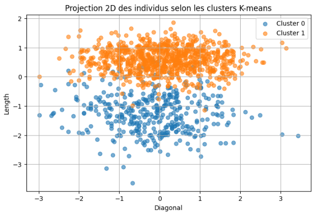

# Projet 01 – Détection de faux billets avec machine learning

## Contexte

Dans le cadre d’une mission pour l’ONCFM (Organisation nationale de lutte contre le faux-monnayage), j’ai été chargé de développer une application de prédiction automatique capable d’identifier si un billet est authentique ou contrefait, à partir de caractéristiques géométriques scannées.

L’objectif : **accélérer la détection sur le terrain grâce au machine learning**, et proposer aux agents une application simple, réutilisable sur de nouveaux lots de billets.

---

## Démarche suivie

- **Préparation des données** : 1 500 billets (1 000 vrais / 500 faux), 6 caractéristiques géométriques par billet.
- **Analyse exploratoire** : traitement des valeurs manquantes (imputation par régression linéaire), visualisation des distributions, corrélations, outliers, etc.
- **Séparation du jeu d’entraînement et de test**.
- **Entraînement et évaluation de plusieurs algorithmes** :
  - Régression logistique
  - KNN (k plus proches voisins)
  - Random Forest
  - K-means (non supervisé, utilisé pour la comparaison)
- **Comparaison des performances** : précision, rappel, F1-score, matrice de confusion (analyse des faux positifs et faux négatifs).
- **Choix du modèle final** : sélection du modèle le plus robuste et interprétable.
- **Développement d’une mini-application dans un notebook**, permettant de prédire la nature d’un billet à partir de ses caractéristiques.

---

## Livrables du dossier

- **Livrables** :
    - *Notebook analyse* : préparation, exploration, entraînement et évaluation des modèles
    - *Notebook application* : application de prédiction utilisable directement (chargement d’un fichier et prédiction en un clic)
    - *Présentation finale* : support PPT synthétique des résultats et recommandations

---

## Ce que ce projet démontre

Ce projet illustre :

- Ma capacité à gérer un projet ML de bout en bout : analyse exploratoire, gestion des valeurs manquantes, modélisation, sélection du meilleur algorithme, documentation claire, mise à disposition d’une application pour utilisateurs non techniques.
- Ma maîtrise des principaux algorithmes de classification (supervisés et non supervisés).
- Ma capacité à comparer objectivement les résultats, et à justifier le choix final de manière pédagogique.
- Une documentation claire, vulgarisée et structurée pour un public métier.
- Une approche réutilisable, prête à être adaptée à d’autres cas de détection.

---

## Pour aller plus loin

- Les notebooks sont documentés et commentés pas à pas.

