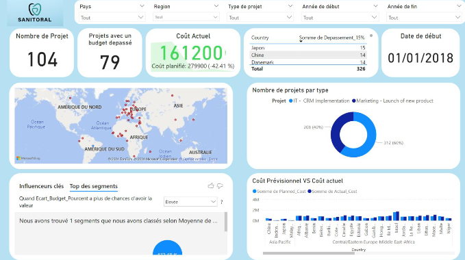

# Projet 2 – Tableau de bord Power BI : Suivi d’avancement de projets

## Contexte

Pour ce projet, j’ai endossé le rôle de Data Analyst chez ESN Data, en mission auprès de Sanitoral, entreprise internationale spécialisée dans les soins bucco-dentaires.
Leur demande : un tableau de bord dynamique permettant de piloter l’avancement des projets, repérer rapidement les retards, analyser les coûts, et offrir aux décideurs une vision claire pour orienter leurs actions.

L’ensemble de la démarche s’est structuré autour de la compréhension approfondie du besoin métier, de la préparation automatisée des données, puis de la conception d’un dashboard interactif sur Power BI.
---

## Démarche suivie

- **Analyse du besoin métier**  
  - Élaboration du *Product Strategy Canvas* pour formaliser les user stories et s’assurer d’une vision claire côté métier.
  - Réalisation d’un *mockup* du dashboard pour validation en amont.

- **Préparation et structuration des données**
  - Nettoyage, transformation et automatisation des traitements dans Power Query Editor.
  - Modélisation des relations entre les différentes tables (projets, phases, tâches…).
  - Documentation claire de la procédure de mise à jour autonome des données.

- **Développement du tableau de bord**
  - Construction de plusieurs pages interactives : suivi des projets, analyse des retards, contrôle des coûts, KPI clés.
  - Intégration d’un onglet dédié à :
    - l’explication du modèle de données,
    - la procédure de rafraîchissement,
    - la synthèse stratégique pour les décideurs.
  - Application des principes de *data storytelling* pour rendre le dashboard accessible, lisible et pertinent pour tous les utilisateurs (directeurs, chefs de projet…).
 

---

## Livrables du dossier

- **Tableau de bord Power BI** : fichier `.pbix` complet, prêt à l’emploi.
- Présentation structurée PDF.

---

## Ce que ce projet démontre

- Ma capacité à comprendre et formaliser un besoin métier, à anticiper les attentes via des outils comme le *Product Strategy Canvas*.
- Ma maîtrise de **Power BI** : modélisation, automatisation, Power Query, DAX, et conception de dashboards avancés.
- Mon sens du *data storytelling* : vulgarisation des résultats, clarté des visualisations, structuration pédagogique du livrable.
- Une attention à l’autonomie du client, grâce à une documentation claire sur la mise à jour des données.

---

> *N’hésitez pas à consulter le fichier de présentation ou le dashboard interactif pour découvrir le projet en détail.*

