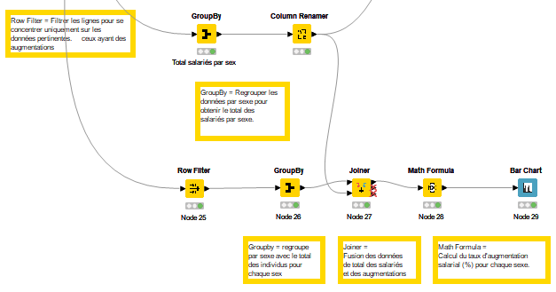

# Projet 3 – Diagnostic Égalité Femmes-Hommes (KNIME & RGPD)

## Contexte

Dans le cadre d’une mission pour un cabinet de conseil en transformation digitale, j’ai été chargé par la direction RH de mettre en place un diagnostic automatisé sur l’égalité professionnelle femmes-hommes, en exploitant les données du SIRH interne.

L’objectif : fournir un rapport fiable, conforme au RGPD et accessible à toutes les parties prenantes de l’entreprise.

---

## Démarche suivie

- **Identification des indicateurs clés**
  - Analyse des recommandations officielles (ministère du Travail)
  - Choix de 6 indicateurs pertinents

- **Préparation et anonymisation des données**
  - Nettoyage et structuration des fichiers issus du SIRH sous KNIME
  - Application de méthodes d’anonymisation respectueuses du RGPD
  - Vérification de la cohérence et suppression des anomalies

- **Construction du workflow automatisé**
  - Création d’un workflow complet et commenté sous KNIME
  - Génération automatisée des graphiques de diagnostic
  - Export d’un fichier `.csv` prêt pour des analyses complémentaires sous Tableau ou Power BI

- **Restitution et recommandations**
  - Calcul du score global d’égalité femmes-hommes de l’entreprise
  - Analyse des écarts et interprétation des résultats
  - Rédaction d’un rapport synthétique : méthodologie, indicateurs, conformité RGPD, axes d’amélioration

---

## Livrables du dossier

- **Workflow KNIME** : fichier `.knwf` complet et annoté
- **Présentation finale** : support synthétique PDF

---

## Ce que ce projet démontre

- Ma capacité à collecter, nettoyer et structurer des données RH complexes
- Ma maîtrise de KNIME pour automatiser des traitements data et garantir la conformité RGPD
- Mon aptitude à vulgariser une analyse technique et à la rendre accessible à tous (RH, direction, collaborateurs…)
- Mon sens de la pédagogie pour formaliser la méthodologie et la rendre reproductible par l’entreprise
- Ma capacité à formuler des recommandations claires et concrètes pour améliorer le score d’égalité

---

> *Consultez le rapport ou le workflow KNIME pour découvrir la méthodologie complète et les résultats obtenus.*

