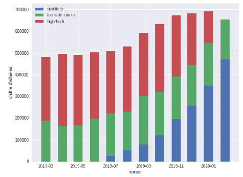

# Projet 4 – Analyse de ventes pour un e-commerce

## Contexte

Au cours de mon expérience chez Le Grand Marché, j’ai réalisé un diagnostic mensuel des ventes afin d’apporter un éclairage opérationnel au service marketing et à la direction.
L’objectif principal était de synthétiser les résultats et tendances du mois écoulé dans un format visuel et facilement exploitable, en mettant l’accent sur les évolutions significatives et les leviers de progression.

---

## Démarche suivie

- **Analyse des données commerciales**
  - Sélection et interprétation des graphiques les plus pertinents parmi les indicateurs clés : chiffre d’affaires, nombre de ventes, visites, panier moyen, taux de conversion, etc.
  - Identification et explication de la baisse du chiffre d’affaires observée, en analysant notamment l’évolution par catégories de produits et la modification de la stratégie commerciale (arrêt du segment High Tech, recentrage sur l’alimentation et les biens de consommation).

- **Construction d’une restitution synthétique**
  - Création d’une présentation concise (5 slides, 5 graphiques) pour la direction, avec un discours adapté à un public non spécialiste.
  - Utilisation des principes du storytelling pour rendre l’analyse vivante, accessible et orientée action.
  - Proposition d’un axe stratégique pour relancer la croissance (ex. : adaptation de l’offre, optimisation des parcours clients…).

- **Analyse des clients affiliés**
  - Complétion d’un tableau Excel dédié aux clients affiliés, intégrant calculs, formules, et une infographie personnalisée pour visualiser la répartition et l’évolution de ce segment spécifique.
 

---

## Livrables du dossier

- **Présentation synthétique** : rapport PDF (5 slides) avec sélection des graphiques, analyse et recommandations stratégiques.
- **Tableau Excel** : fichier complet pour le suivi et l’analyse des clients affiliés, avec visualisation.

---

## Ce que ce projet démontre

- Ma capacité à extraire des insights pertinents à partir de données brutes et de visualisations existantes.
- Mon aptitude à construire une restitution claire, dynamique et adaptée à un public non technique.
- Ma rigueur dans la synthèse, la sélection des indicateurs, et la formulation de recommandations concrètes.
- Une maîtrise des outils de reporting (Excel, data visualisation) et du storytelling appliqué à la data.

---

> *Consultez la présentation ou le fichier Excel pour découvrir l’analyse complète et les propositions stratégiques formulées.*

