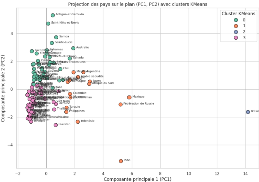

# Projet 05 – Étude de marché internationale avec Python

## Contexte

Dans le cadre d’une mission de Data Analyst pour l’entreprise “La Poule qui Chante”, spécialisée dans le poulet bio, j’ai été chargé de conduire une étude de marché pour identifier les meilleurs pays à cibler dans une stratégie d’export à l’international.  
L’objectif était de structurer une démarche analytique complète, de la collecte open data au clustering, pour formuler des recommandations claires à la direction.

---

## Démarche suivie

- **Collecte et préparation des données**
  - Constitution d’un jeu de données à partir de plusieurs sources ouvertes (FAO, Banque mondiale, autres portails).
  - Application de la méthode PESTEL pour sélectionner au moins 8 variables stratégiques (démographie, économie, consommation, environnement, stabilité politique, etc.).
  - Création de nouvelles variables via du feature engineering.
  - Nettoyage, normalisation et intégration des données pour garantir leur fiabilité sur plus de 100 pays.

- **Exploration et analyse multivariée**
  - Statistiques descriptives et visualisations pour identifier les grandes tendances du marché mondial.
  - Analyse en Composantes Principales (ACP) pour réduire la dimensionnalité, comprendre les axes forts et visualiser les corrélations entre variables et pays.

- **Segmentation et recommandations**
  - Clustering des pays via CAH (Classification Ascendante Hiérarchique) puis k-means pour regrouper les marchés similaires.
  - Comparaison des méthodes de clustering et choix du découpage le plus pertinent.
  - Formulation de recommandations stratégiques adaptées au contexte de l’entreprise, avec justification des pays cibles retenus.

- **Restitution adaptée au public dirigeant**
  - Construction d’une présentation synthétique, vulgarisée, orientée action pour le COMEX.

---

## Livrables du dossier

- **Notebook préparation & nettoyage** : traitement initial, intégration et exploration des données.
- **Notebook clustering & visualisations** : ACP, segmentation, visualisations avancées.
- **Présentation finale** : support destiné au COMEX, structuré pour un public non technique.

---

## Ce que ce projet démontre

- Ma capacité à construire une étude de marché à partir de données ouvertes et à intégrer des variables hétérogènes.
- Mes compétences en analyse statistique avancée (ACP, clustering) et en feature engineering.
- Mon autonomie dans la recherche, la préparation et la justification méthodologique des données.
- Mon aptitude à présenter des résultats de façon claire, synthétique et exploitable par une direction non spécialiste.

---

> *Consultez les notebooks ou la présentation pour une vision complète de l’analyse et des recommandations.*
