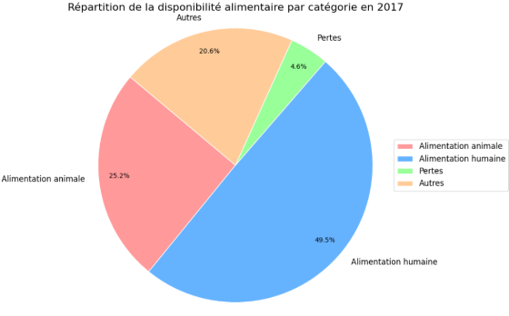

# Projet 06 – Étude de santé publique avec Python 

## Contexte

Pour ce projet, j’ai rejoint une équipe de recherche à la FAO (Organisation des Nations Unies pour l’alimentation et l’agriculture), afin de contribuer à une grande étude sur la sous-nutrition mondiale.  
Ma mission : exploiter et analyser les données historiques de 2013 à 2017, en poursuivant le travail initié par l’analyste précédent, et en développant des analyses complémentaires pour enrichir l’état des lieux.

---

## Démarche suivie

- **Analyse et structuration des données**
  - Prise en main des fichiers FAO et du lexique fourni
  - Nettoyage, préparation et vérification de la cohérence des jeux de données
  - Organisation du notebook pour garantir clarté et traçabilité des étapes

- **Construction d’indicateurs et visualisations**
  - Calcul des indicateurs clés de la sous-nutrition et évolution sur la période
  - Comparaison géographique entre zones, pays ou continents
  - Création de graphiques synthétiques et accessibles pour appuyer la restitution

- **Restitution et enrichissement**
  - Structuration d’un support de présentation pour la soutenance (résultats, analyses, points saillants)
  - Intégration d’analyses complémentaires ou d’approches innovantes selon les observations
  - Documentation des choix méthodologiques pour faciliter la reproduction et la compréhension par l’équipe

---

## Livrables du dossier

- **Notebook Python** : toutes les étapes d’analyse et de traitement, bien commentées
- **Présentation synthétique** : support de restitution des résultats principaux (PDF)

---

## Ce que ce projet démontre

- Mon autonomie dans la reprise et la poursuite d’un projet existant
- Ma capacité à nettoyer, structurer et analyser des données réelles avec Python (pandas, matplotlib…)
- Mon attention à la clarté et à la pédagogie dans la restitution de résultats à des non-spécialistes
- Mon sens du détail dans la documentation des étapes, pour garantir la reproductibilité et la conformité aux exigences du projet

---

> *Consultez le notebook ou la présentation finale pour découvrir l’intégralité de l’analyse et des résultats obtenus.*

