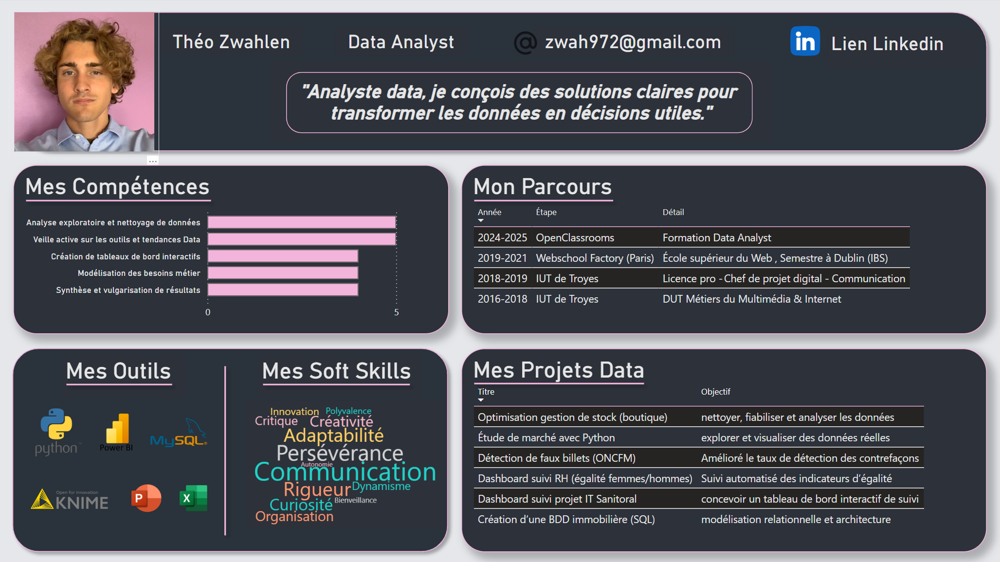

# Portfolio Data Analyst Aéroworld – Théo ZWAHLEN

Bienvenue sur mon portfolio de Data Analyst, créé spécifiquement pour répondre à la demande du client Aéroworld.

## Projet présenté : Mission Consultant Data pour Aéroworld

Ce portfolio regroupe **l’intégralité des livrables réalisés dans le cadre du projet Aéroworld** :
- Analyse du besoin client et cahier des charges de la mission
- Dashboards (profil & veille métier)
- Documentation des procédures
- Vidéo de formation

**Objectif** : démontrer la maîtrise des compétences attendues, la rigueur méthodologique, l’esprit d’innovation et la posture professionnelle d’un consultant data au service d’un grand compte.

---

## Accès direct aux livrables du projet Aéroworld

👉 [Dossier principal du projet Aéroworld](7.%20Cr%C3%A9ez%20votre%20portfolio%20de%20professionnel%20de%20la%20data)

---

En complément de la mission Aéroworld, ce portfolio présente aussi une sélection de mes autres projets data menés dans des contextes variés (RH, e-commerce, santé publique, etc.).

Mon objectif : mettre en valeur ma capacité à analyser, modéliser, visualiser et restituer la donnée, et à adopter une posture de consultant orientée business.

---

## Projets réalisés

Chaque dossier de projet contient :  
- Un résumé du contexte et des objectifs  
- Une explication des données traitées et outils utilisés  
- Les livrables (dashboards, notebooks, etc)

| N°  | Projet                                                                                                            | Description rapide                | Outils principaux   |
|-----|-------------------------------------------------------------------------------------------------------------------|-----------------------------------|---------------------|
| 01  | [Détection de faux billets](1.%20Détectez%20des%20faux%20billets%20avec%20Python)                                | Machine learning supervisé        | Python              |
| 02  | [Tableau de bord Power BI (Sanitoral)](2.%20Créez%20un%20tableau%20de%20bord%20dynamique%20avec%20Power%20BI%20pour%20visualiser%20l'avancement%20de%20projets) | Modèle de données, Power Query, reporting | Power BI     |
| 03  | [Diagnostic égalité F/H + RGPD](3.%20Analysez%20des%20indicateurs%20de%20l'%C3%A9galit%C3%A9%20femmes,%20hommes%20en%20respect%20du%20RGPD) | KNIME, anonymisation, restitution plénière | KNIME   |
| 04  | [Analyse de ventes pour un e-commerce](4.%20Faites%20une%20analyse%20de%20ventes%20pour%20un%20e-commerce)       | Analyse Excel, recommandations marketing | Excel, Power BI    |
| 05  | [Étude de marché internationale](5.%20Produisez%20une%20%C3%A9tude%20de%20march%C3%A9%20avec%20Python)           | Open Data, clustering, ACP        | Python              |
| 06  | [Étude de santé publique](6.%20R%C3%A9alisez%20une%20%C3%A9tude%20de%20sant%C3%A9%20publique%20avec%20Python)   | Pandas, visualisation             | Python (pandas)     |
| 07  | [Portfolio professionnel (Aéroworld)](7.%20Cr%C3%A9ez%20votre%20portfolio%20de%20professionnel%20de%20la%20data) | Storytelling, livrables pro, posture analyste | Power BI     |

---

## Compétences clés mobilisées

- **Analyse exploratoire et nettoyage de données** (Python, Excel, Power BI)
- **Modélisation et manipulation de bases de données** (SQL, KNIME)
- **Visualisation et reporting** (Power BI, matplotlib)
- **Automatisation des traitements** (Python, KNIME)
- **Machine Learning & classification** (Random Forest, clustering, ACP)
- **RGPD, anonymisation et qualité des données**
- **Data storytelling & vulgarisation** (présentations, vidéos, documentation)
- **Gestion de projet, posture de consultant** (accompagnement des équipes)

---

## Contact

- **Email** : [zwah972@gmail.com](mailto:zwah972@gmail.com)
- **LinkedIn** : [https://www.linkedin.com/in/théo-zwahlen-25941720a/](https://www.linkedin.com/in/théo-zwahlen-25941720a/)

> Pour toute question, n’hésitez pas à me contacter ou à explorer les dossiers de projet.  

---

